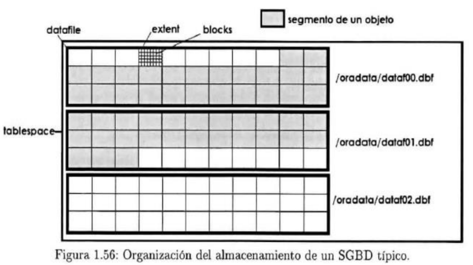

# CUOTAS DE ALMACENAMIENTO

## ¿Por qué es importante el espacio en disco?

Base de datos y objetos de BD

### Extensiones o extent dentro de las bases de datos

Las tablas se dividen en extensiones o particiones de datos. Cada extensión es un segmento horizontal de la tabla que contiene datos y metadatos, como su tiempo de creación y etiquetas opcionales. La unión de todas estas extensiones contiene todo el conjunto de datos de la tabla.

### ¿Que son los segmentos dentro de las bases de datos?

Un segmento es un conjunto de extensiones que contienen toda la información para una estructura lógica de almacenamiento específico dentro de un espacio de tablas.

### ¿Qué es un tablespace?

Un tablespace es una ubicación de almacenamiento donde pueden ser guardados los datos correspondientes a los objetos de una base de datos1. Es una unidad lógica de almacenamiento que está compuesta por uno o varios archivos físicos (archivos de datos).

### ¿Qué es un datablock?

Es un espacio de memoria donde se almacenan valores a los que debe acceder una máquina o instalación. Un datablock se puede concebir como una caja donde se almacena información de forma clasificada, etiquetando esa información con diferentes nombres (variables).

### SINTAXIS

En MB

> select table_schema as "base de datos", round(sum(data_length+index_length)/1024/1024,2) as "Tamaño MB" from information_schema.tables group by table_schema;

En GB

> select table_schema as "base de datos", round(sum(data_length+index_length)/1024/1024/1024,2) as "Tamaño GB" from information_schema.tables group by table_schema;
