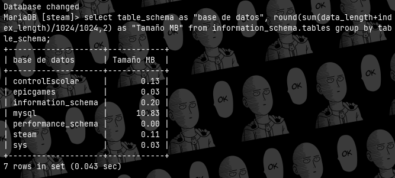
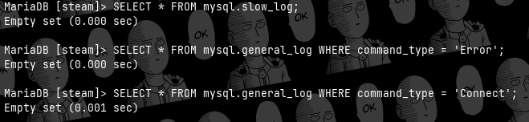
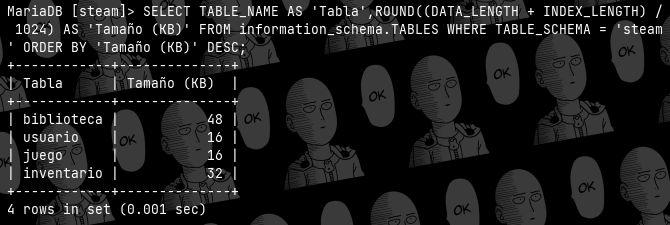
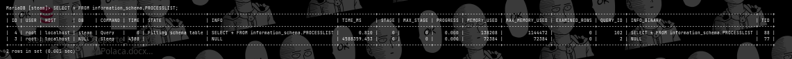

# Preguntas de leti

### ¿Cuál es la capacidad de almacenamiento que ocupan tu base de datos?

El almacenamiento que usa mi base de datos 'steam' es de 0.11 MB. Se usa el siguiente comando.

select table_schema as "base de datos", round(sum(data_length+index_length)/1024/1024,2) as "Tamaño MB" from information_schema.tables group by table_schema;

### ¿El software de base de datos genera y almacena logs sobre la manipulación y acceso a las bases de datos? ¿Dónde los almacena? ¿Cómo las almacena? ¿Cuándo las almacena?

Sí, MariaDB genera logs que registran diversas actividades, como consultas SQL ejecutadas, errores de base de datos, conexiones de clientes, cambios en la configuración del servidor, entre otros eventos relevantes.
Los logs de MariaDB se almacenan en archivos en el sistema de archivos del servidor de base de datos. La ubicación y el nombre de estos archivos pueden variar según la configuración del servidor, pero generalmente se encuentran en un directorio específico designado para logs.
Se almacenan en archivos de texto plano, lo que los hace legibles y accesibles para su análisis. Cada tipo de log (por ejemplo, errores, consultas, conexiones) se almacena en un archivo separado, lo que facilita la gestión y el análisis de los registros.
Por ejemplo, cuando se ejecuta una consulta SQL, se registra en el log de consultas; cuando ocurre un error en la base de datos, se registra en el log de errores; y así sucesivamente. Los registros se almacenan en tiempo real a medida que se producen los eventos.
En este caso, ejemplos de querys capaces de solicitar estos datos son:

SELECT * FROM mysql.slow_log;

SELECT * FROM mysql.general_log WHERE command_type = 'Error';

SELECT * FROM mysql.general_log WHERE command_type = 'Connect';

En este caso aún no hay logs por eso se muestran vacios.

### ¿Cuál es la entidad, objeto, archivo o tabla (lo que fuera según el motor de base de datos que utilicen) que crece más en comparación a otras?

La tabla que más crece en comparación con el resto es la biblioteca, debido a que una sola biblioteca de un usuario puede contener multiples juegos de su propiedad y contienen más cantidad de datos. Esta actualmente pesa 48 KB y se puede saber su peso con la siguiente consulta:

SELECT TABLE_NAME AS 'Tabla', ROUND((DATA_LENGTH + INDEX_LENGTH) / 1024) AS 'Tamaño (KB)' FROM information_schema.TABLES WHERE TABLE_SCHEMA = 'steam' ORDER BY 'Tamaño (KB)' DESC;

### ¿Cuántas aplicaciones y/o clientes se conectan a las bases de datos?
Para saber las conexiones que están activas se puede consultar el archivo Connect o realizar una consulta para revisar la lista de procesos.

SELECT * FROM information_schema.PROCESSLIST;

### ¿Cuál es el volumen de consultas (lecturas) que reciben las bases de datos?
Dependiendo de la base de datos, es el volumen de consultas que se estan recibiendo, pero en caso de querer saber cuantas son las consultas activas que estan siendo solicitadas en ese momento, se puede usar la siguiente consulta:

SELECT COUNT(*) AS 'Cantidad de consultas' FROM information_schema.PROCESSLIST WHERE DB = 'steam';

### ¿Cuáles son las consultas de información más demandadas de tu base de datos?

?????

### ¿Cuál es la hora pico que demanda un mayor uso de recursos del servidor de base de datos?

???

### ¿Cuántos registros soporta una base de datos en MySQL/MariaDB?

En general, MySQL y MariaDB son capaces de manejar grandes volúmenes de datos y pueden soportar millones o incluso miles de millones de registros en una sola tabla. Sin embargo, alcanzar este límite dependerá de varios factores, como el motor.

InnoDB:
Soporta transacciones ACID (Atomicidad, Consistencia, Aislamiento, Durabilidad).
Soporta claves foráneas (foreign keys).
Gestiona bloqueos a nivel de fila para lecturas y bloqueos a nivel de tabla para escrituras.
Límites típicos incluyen:
Tamaño máximo de tabla: 64 TB (tebibytes) en MariaDB 10.2 y versiones posteriores, 64 TB en MySQL 5.6 y versiones posteriores.
Número máximo de columnas: 1000 por tabla.
Tamaño máximo de índice: 767 bytes por columna.
Tamaño máximo de fila: 65535 bytes.

MyISAM:
No soporta transacciones ACID.
No soporta claves foráneas.
Utiliza bloqueos a nivel de tabla para lecturas y escrituras.
Límites típicos incluyen:
Tamaño máximo de tabla: 256 TB.
Número máximo de columnas: 64 por tabla.
Tamaño máximo de índice: 1000 bytes por columna.
Tamaño máximo de fila: 65535 bytes.

MEMORY (HEAP):
Almacena tablas completamente en memoria.
Rápido acceso a datos, pero los datos se pierden cuando se reinicia el servidor.
Límites típicos incluyen:
Tamaño máximo de tabla: depende del tamaño de la memoria disponible.
Número máximo de columnas: 259 por tabla.
Tamaño máximo de índice: 255 bytes por columna.
Tamaño máximo de fila: depende del tamaño de la memoria disponible.

ARCHIVE:
Diseñado para el almacenamiento de datos históricos o de archivo.
Los datos se comprimen automáticamente.
No soporta transacciones ACID.
Límites típicos incluyen:
Tamaño máximo de tabla: 256 TB.
Número máximo de columnas: 64 por tabla.
Tamaño máximo de índice: No hay índices.