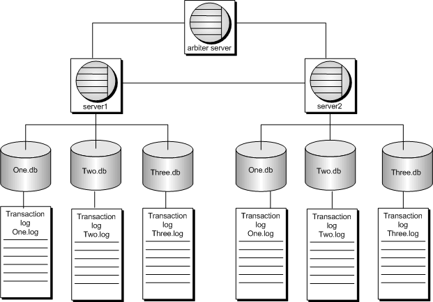

# Espejeo (Mirroring)

Es una configuración donde dos o tres servidores de dase de datos, ejecutándose en equipos independientes, cooperan para mantener copias de la base de datos y archivo de registro de transacciones (log).

### Funcionamiento
Tanto el servidor primario ​como el servidor espejo mantienen una copia de la base de datos y el registro de transacciones, mientras que el tercer servidor, llamado el servidor árbitro, es usado cuando es necesario determinar cuál de los los otros dos servidores puede tomar la propiedad de la base de datos. El árbitro no mantiene una copia de la base de datos. La configuración de los tres servidores de base de datos (el primario, el espejo y el árbitro) es llamado Sistema Espejo (Mirroring System), y el servidor primario y espejo juntos son llamados Servidores Operacionales (Operational Servers) o Compañeros (Partners).

### Esquema

