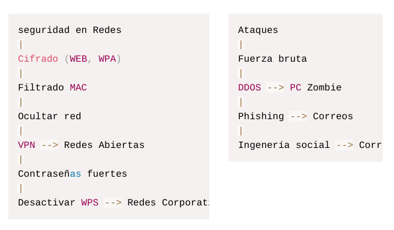

# Seguridad en redes

# ¿Qué mecanismos existen para proteger el envío de datos a través de una pagina de internet?

## Segmentación de Redes

En redes grandes dividir la red en subredes más pequeñas. Esto ayuda a minimizar el alcance de posibles ataques.

## Monitorización Activa

Implementar sistemas que supervisen el tráfico en tiempo real, como:

- IDS/IPS (Intrusion Detection/Prevention Systems): Detectan actividades sospechosas y pueden bloquear amenazas automáticamente.
- Sistemas SIEM (Security Information and Event Management): Recopilan y analizan datos de seguridad para identificar patrones de ataque.

## Configuración Segura de Dispositivos

- Cambiar las credenciales predeterminadas de routers, puntos de acceso y otros dispositivos.
- Actualizar regularmente el firmware para corregir vulnerabilidades conocidas.

## Control de Acceso

Además del filtrado MAC, se recomienda:

- Autenticación 802.1X Utilizado en redes corporativas para controlar el acceso mediante credenciales específicas o certificados.
- Principio de Mínimos Privilegios: Proporcionar solo los permisos necesarios a cada usuario o dispositivo.

## Seguridad Física

En redes críticas, la seguridad física es crucial:

- Asegurar los equipos en ubicaciones restringidas.
- Implementar cámaras y sistemas de acceso físico controlado para prevenir manipulaciones.

## Auditorías y Pruebas de Penetración

- Realizar auditorías de seguridad periódicas para detectar configuraciones débiles o mal prácticas.
- Simular ataques mediante pruebas de penetración para identificar posibles vulnerabilidades antes de que sean explotadas.

## Protecciones Contra Ataques Específicos

- Anti-DDoS: Sistemas para mitigar ataques de denegación de servicio distribuido en redes abiertas o corporativas.
- Bloqueo de Escaneo de Puertos: Configurar firewalls para detectar y prevenir escaneos de puertos, que suelen ser una etapa inicial de los ataques.

## Políticas de Uso

- Definir políticas claras para los usuarios, como limitar el uso de redes abiertas o no autorizadas.
- Capacitar a los empleados en higiene digital, como evitar conexiones no seguras o descargas de archivos sospechosos.

## Seguridad en Dispositivos IoT

En redes modernas, los dispositivos IoT presentan nuevos vectores de ataque.
Para protegerlos:

- Crear una subred específica para IoT.
- Deshabilitar características innecesarias y usar credenciales seguras.

# ¿Qué es un sistema de detección de intrusos?

Un sistema de detección de intrusos (IDS, por sus siglas en inglés) es una herramienta o software diseñado para monitorear y analizar el tráfico de red o actividades dentro de un sistema con el objetivo de identificar posibles amenazas, ataques o accesos no autorizados.

Su principal función es alertar a los administradores de seguridad sobre actividades sospechosas, como intentos de explotación de vulnerabilidades, escaneos de puertos o tráfico inusual, pero no actúa directamente para prevenir dichos eventos.

Existen dos tipos principales de IDS los basados en red NIDS, que supervisan el tráfico en toda la red, y los basados en host HIDS, que analizan actividades específicas de dispositivos o sistemas. Aunque el IDS es fundamental para identificar ataques en tiempo real, su alcance se limita a la detección, dejando las medidas correctivas en manos de los operadores.

# ¿Qué es un sistema de prevención de intrusos?

Un sistema de prevención de intrusos (IPS, por sus siglas en inglés) es una solución proactiva que no solo detecta actividades maliciosas o sospechosas en una red, sino que también actúa automáticamente para prevenirlas o bloquearlas. A diferencia del IDS, el IPS tiene la capacidad de interrumpir conexiones sospechosas, bloquear direcciones IP maliciosas o detener paquetes de datos potencialmente dañinos antes de que lleguen a su destino. Funciona en tiempo real y está diseñado para evitar que ataques como denegación de servicio (DDoS), intentos de inyección SQL o exploits específicos afecten a la red o los sistemas. Es una herramienta esencial para proteger infraestructuras críticas, ya que combina la capacidad de detección con una respuesta inmediata y automatizada a las amenazas.
